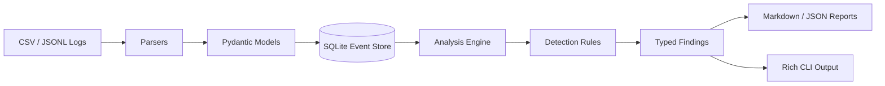

# LogScope Architecture

LogScope is a small, typed Python application organized around clear boundaries between ingestion, domain logic, persistence, and user-facing commands.

## Flow



## Modules

### `models.py`

Defines strongly validated event and finding models. Timestamps are normalized to UTC and IP addresses are validated before storage.

### `parsers.py`

Supports CSV, JSONL, and NDJSON ingestion. Parsing errors include the source row or line number to make malformed data easier to troubleshoot.

### `storage.py`

Provides a lightweight SQLite-backed repository. It stores normalized events and analysis findings and creates indexes for common time-, identity-, and source-based lookups.

### `rules.py`

Contains pure defensive detection logic. Current rules identify:

- repeated authentication failures;
- password-spray-like behavior across multiple usernames;
- bursts of HTTP 5xx responses.

Rules return structured evidence rather than printing directly, which makes them testable and reusable.

### `engine.py`

Coordinates detection rules and orders findings by severity and time.

### `reporting.py`

Produces Markdown reports and JSON findings suitable for sharing, further automation, or importing into another system.

### `cli.py`

Exposes the package as a command-line application:

```text
logscope ingest
logscope analyze
logscope summary
logscope report
```

## Engineering choices

### Python package instead of a single script

The project uses a `src/` layout and installable package metadata so it behaves like a real Python codebase rather than a one-file exercise.

### Static and runtime validation

Python type hints are checked with mypy, while Pydantic validates data at runtime. These solve different problems and are intentionally used together.

### Pure detection functions

Detection rules are separated from storage and CLI code. This makes them easy to unit test and allows future use in batch jobs, APIs, or streaming systems.

### SQLite for local reproducibility

SQLite keeps the project easy to run while still demonstrating SQL-backed persistence and indexing. The repository boundary makes PostgreSQL a natural future replacement.

### Quality gates

GitHub Actions runs:

1. Ruff linting;
2. strict mypy checks;
3. pytest with branch coverage;
4. package build validation.

## Future extensions

Natural improvements include:

- streaming ingestion;
- structured syslog support;
- configurable YAML detection rules;
- PostgreSQL persistence;
- FastAPI read-only dashboards;
- alert delivery;
- Sigma-rule interoperability;
- OpenTelemetry metrics.
